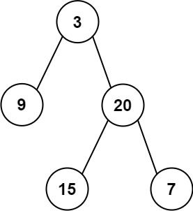

# 剑指 Offer 07. 重建二叉树
## 题目描述
输入某二叉树的前序遍历和中序遍历的结果，请构建该二叉树并返回其根节点。<br />
假设输入的前序遍历和中序遍历的结果中都不含重复的数字。<br />

来源：力扣（LeetCode）<br />
链接：https://leetcode.cn/problems/zhong-jian-er-cha-shu-lcof <br />
著作权归领扣网络所有。商业转载请联系官方授权，非商业转载请注明出处。<br />
## 题目要求
- 0 <= 节点个数 <= 5000
## 测试样例
 <br />
Input: preorder = [3,9,20,15,7], inorder = [9,3,15,20,7] <br />
Output: [3,9,20,null,null,15,7] <br />

Input: preorder = [-1], inorder = [-1] <br />
Output: [-1] <br />
# 官方题解
```java
class Solution {
    private Map<Integer, Integer> indexMap;

    public TreeNode myBuildTree(int[] preorder, int[] inorder, int preorder_left, int preorder_right, int inorder_left, int inorder_right) {
        if (preorder_left > preorder_right) {
            return null;
        }

        // 前序遍历中的第一个节点就是根节点
        // 在中序遍历中定位根节点
        int inorder_root = indexMap.get(preorder[preorder_left]);
        
        // 先把根节点建立出来
        TreeNode root = new TreeNode(preorder[preorder_left]);
        // 得到左子树中的节点数目
        int size_left_subtree = inorder_root - inorder_left;
        // 递归地构造左子树，并连接到根节点
        // 先序遍历中「从 左边界+1 开始的 size_left_subtree」个元素就对应了中序遍历中「从 左边界 开始到 根节点定位-1」的元素
        root.left = myBuildTree(preorder, inorder, preorder_left + 1, preorder_left + size_left_subtree, inorder_left, inorder_root - 1);
        // 递归地构造右子树，并连接到根节点
        // 先序遍历中「从 左边界+1+左子树节点数目 开始到 右边界」的元素就对应了中序遍历中「从 根节点定位+1 到 右边界」的元素
        root.right = myBuildTree(preorder, inorder, preorder_left + size_left_subtree + 1, preorder_right, inorder_root + 1, inorder_right);
        return root;
    }

    public TreeNode buildTree(int[] preorder, int[] inorder) {
        int n = preorder.length;
        // 构造哈希映射，帮助我们快速定位根节点
        indexMap = new HashMap<Integer, Integer>();
        for (int i = 0; i < n; i++) {
            indexMap.put(inorder[i], i);
        }
        return myBuildTree(preorder, inorder, 0, n - 1, 0, n - 1);
    }
}
```