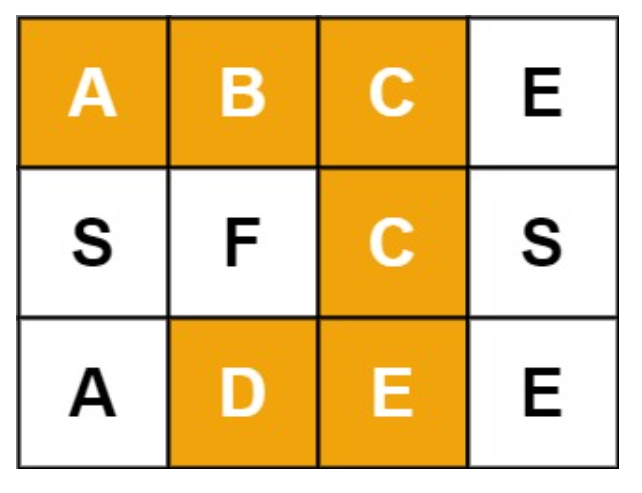

# 剑指 Offer 12. 矩阵中的路径
## 题目描述
给定一个m x n 二维字符网格board 和一个字符串单词word 。如果word 存在于网格中，返回 true ；否则，返回 false 。<br />
单词必须按照字母顺序，通过相邻的单元格内的字母构成，其中“相邻”单元格是那些水平相邻或垂直相邻的单元格。同一个单元格内的字母不允许被重复使用。<br />
例如，在下面的 3×4 的矩阵中包含单词 "ABCCED"（单词中的字母已标出）。<br />
 <br />

来源：力扣（LeetCode）<br />
链接：https://leetcode.cn/problems/ju-zhen-zhong-de-lu-jing-lcof <br />
著作权归领扣网络所有。商业转载请联系官方授权，非商业转载请注明出处。<br />
## 题目要求
- 1 <= board.length <= 200 
- 1 <= board[i].length <= 200 
- board 和 word 仅由大小写英文字母组成
## 测试样例
输入：board = [["A","B","C","E"],["S","F","C","S"],["A","D","E","E"]], word = "ABCCED" <br />
输出：true <br />

输入：board = [["a","b"],["c","d"]], word = "abcd" <br />
输出：false <br />
# 官方题解
```java
class Solution {
    public boolean exist(char[][] board, String word) {
        int h = board.length, w = board[0].length;
        boolean[][] visited = new boolean[h][w];
        for (int i = 0; i < h; i++) {
            for (int j = 0; j < w; j++) {
                boolean flag = check(board, visited, i, j, word, 0);
                if (flag) {
                    return true;
                }
            }
        }
        return false;
    }

    public boolean check(char[][] board, boolean[][] visited, int i, int j, String s, int k) {
        if (board[i][j] != s.charAt(k)) {
            return false;
        } else if (k == s.length() - 1) {
            return true;
        }
        visited[i][j] = true;
        int[][] directions = {{0, 1}, {0, -1}, {1, 0}, {-1, 0}};
        boolean result = false;
        for (int[] dir : directions) {
            int newi = i + dir[0], newj = j + dir[1];
            if (newi >= 0 && newi < board.length && newj >= 0 && newj < board[0].length) {
                if (!visited[newi][newj]) {
                    boolean flag = check(board, visited, newi, newj, s, k + 1);
                    if (flag) {
                        result = true;
                        break;
                    }
                }
            }
        }
        visited[i][j] = false;
        return result;
    }
}
```